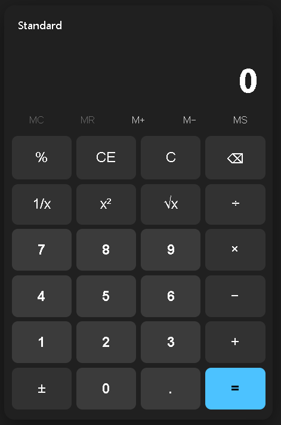
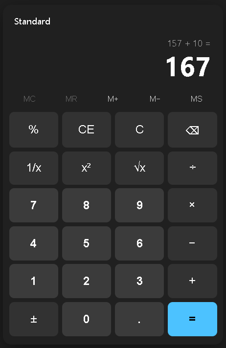

# Maestro

A conductor-led team of specialist subagents for Claude Code. Hand Maestro a story, task, or
even a rough idea; it runs the work through a real high-functioning team — a strategist who
verifies intent, a principal engineer who architects, a staff engineer who implements, and four
**independent verifiers** (code review, security, QA, UX) who can each send the work back — and
returns a change that's been reviewed the way a serious team reviews before shipping.

The **orchestrator** (the conductor) doesn't write or review code. It routes work, breaks ties
when verifiers conflict, curates exactly the context each agent needs, decides whether a finding
should **block**, **backlog**, or (rarely) be **dismissed**, enforces a retry ceiling, and hands
the human a clear summary at the end.

---

## The team

| Agent | Role | Can send work back? |
|-------|------|:---:|
| **Strategist** | Knows and verifies the requirement; turns intent into testable acceptance criteria | — |
| **Principal Engineer** | Architect — smallest clean design that fits the codebase | — |
| **Staff Engineer (Implementer)** | Writes the change | — |
| **Code Reviewer** | Enforces KISS + best practices, verifies the requirement was met | ✅ |
| **Security Engineer** | Best practices, compliance, no new risk | ✅ |
| **QA Engineer** | Verifies against acceptance criteria | ✅ |
| **UX Engineer** | World-class user experience; verifies user-facing behavior | ✅ |
| **Orchestrator** (conductor) | Routing, tie-breaking, context assembly, disposition, retry limits | it *is* the gate |

---

## How it actually works (an important architecture note)

In Claude Code, **a subagent cannot invoke other subagents** — only the main session can. So the
orchestrator is **not** an eighth subagent. It's a **Skill run by the main session**, which *can*
spawn the seven role subagents via the Agent tool. Everything the conductor needs to do —
routing, arbitration, context curation, backlog, retries — lives in that skill
(`skills/maestro-orchestrator/SKILL.md`). This is more portable, versioned, and testable than
baking the logic into a project's `CLAUDE.md`, and it's the only shape that actually runs.

The verifiers are **read-only** and **return** structured verdicts; the orchestrator is the
**sole writer** of state, so parallel verification never races on the state file.

Hooks are intentionally *not* load-bearing: the `SubagentStop` payload doesn't include a
subagent's output, so it can't drive routing. Maestro uses it only for a convenience audit trail.
The authoritative audit is the orchestrator's own `history` log.

---

## Proof it works

Don't take the description on faith — read an actual end-to-end run. The
[**dry runs**](docs/dry-runs/) folder holds full execution transcripts: the task, every stage,
each verifier's verdict, findings and how they were disposed, rework loops, and independently
re-run test output.

- [Run 001 — email validator](docs/dry-runs/001-email-validator.md): clean happy path. Notably,
  the security verifier *empirically load-tested the regex for ReDoS* and QA *re-ran the test
  suite itself* — the gates do real, independent work, not rubber-stamping.
- [Run 002 — path-traversal rework](docs/dry-runs/002-path-traversal-rework.md): a verifier
  **rejects**, the orchestrator routes the finding back, and re-verification confirms the
  specific fix — the loop-back and finding-disposition machinery in action.
- [Run 003 — escalation on a requirement conflict](docs/dry-runs/003-escalation-requirement-conflict.md):
  security and UX demand *mutually exclusive* things and the requirement never settled it, so the
  orchestrator **escalates to the human** with a structured decision instead of arbitrating a
  product call it has no business making — and wastes zero rework loops doing it.
- [Run 004 — the retry ceiling](docs/dry-runs/004-retry-ceiling.md): an unbounded requirement where
  every rework fixes its case and the verifier finds one more. The **retry ceiling** stops the loop
  after N passes and escalates the *cause* (undefined scope) rather than looping forever — the
  safety bound that lets you run this semi-autonomously.
- [Run 005 — a real calculator app](docs/dry-runs/005-calculator-app.md): "build a visual calculator
  like the Windows one" taken from a 9-word ask to a shipped, self-contained
  [working app](docs/dry-runs/artifacts/005-calculator.html) — via a **multi-turn strategist↔principal
  scope negotiation**, a testable engine/UI architecture (28/28 headless golden-vector tests, a
  20k-sequence fuzz), a dedicated **visual-fidelity** review, and one rework loop.

  <p align="center">
    
    &nbsp;&nbsp;
    
  </p>
  <p align="center"><em>Delivered by the pipeline from the one-line request above — Windows 11 Standard fidelity, light/dark, mouse + keyboard.</em></p>

- [Run 006 — token accounting](docs/dry-runs/006-token-accounting.md): a best-effort **token
  ledger** the orchestrator writes once per turn — per-turn `subagent_tokens` plus `total`,
  `by_agent`, and `by_stage` rollups, visible after every turn via `/maestro-status`. Missing
  usage degrades gracefully to a `null` turn; the schema is purely additive; and no decision path
  ever reads it — **observability only**, dogfooded on its own build run.
- [Run 007 — a rework loop, dogfooded](docs/dry-runs/007-rework-dogfood.md): launched from a
  **backlog item** (BL-0001) the prior run deferred. A 4/4-passing change still earns a **tight
  rework loop** for two low nits, cleared by **curated re-verification** — only the two verifiers
  who raised findings re-check them (a third to two-thirds the cost of a full review); security and
  QA aren't re-run because nothing in their domain changed. Closes the whole lifecycle: backlog →
  re-scope → build → verify → rework → re-verify → ship → `resolved`.
- [Run 008 — a feasibility command that answers "no"](docs/dry-runs/008-what-if-feasibility.md):
  builds **`/what-if`** — runs the strategist and architect, then **stops before any code** and
  returns an honest `FEASIBLE` / `FEASIBLE_WITH_CAVEATS` / `INFEASIBLE` verdict with cited evidence.
  Exercised on its own example mid-run (`/what-if "can token usage split input/output tokens?"`), it
  returned a well-evidenced **INFEASIBLE** — Maestro's only source is one aggregate `subagent_tokens`
  scalar. Promotion (`/maestro run WHATIF-<id>`) re-runs the **full** pipeline; `INFEASIBLE` is
  refused. Assess-before-you-build, with a real "no".

## Install

```bash
# add this repo as a marketplace, then install the plugin
claude plugin marketplace add consultwithmike/maestro
claude plugin install maestro
```

Or point at a local checkout during development:

```bash
claude plugin marketplace add ./path/to/maestro
claude plugin install maestro
```

---

## Use

```
/maestro Add rate limiting to the public API: 100 req/min per API key, 429 on exceed.
```

Other entry points:

- `/maestro-status [task_id]` — current stage, verifier votes, open rework reasons, retry count.
- `/maestro-backlog list` — everything that got deferred.
- `/maestro-backlog run BL-0007` — launch a fresh pipeline scoped from a backlog item.

The pipeline stops and asks you when it should: a high-severity security finding, the retry
ceiling is hit, or the verifiers disagree about what the requirement actually *means*.

---

## State

Runtime state lives under `.maestro/` in your repo (git-ignored by default):

```
.maestro/
├── backlog.json                 # cross-task deferred findings
├── audit.log                    # convenience trace from the SubagentStop hook
└── tasks/<task_id>/
    ├── status.json              # single source of truth (schemas/task-status.schema.json)
    ├── requirement.md           # strategist output
    ├── architecture.md          # principal output
    ├── diff-vNN.md              # implementer output per pass
    └── raw/<seq>-<agent>.md      # captured raw agent outputs
```

The two files are validated by JSON Schemas in `schemas/`.

---

## Design decisions baked in

- **Requirement is immutable.** The human's words are stored verbatim and every agent is measured
  against them. The strategist normalizes *around* them; it never overwrites them.
- **Context is curated, not dumped.** Each agent gets only the artifacts on its whitelist
  (`context_requirements`) plus the specific rework findings that `target` it. A UX rejection that
  goes back to the implementer is *also* shown to the code reviewer next pass — so the reviewer
  can confirm that exact fix — but the security engineer never sees UX noise.
- **Normalization is structured, not lossy.** Cross-agent findings are re-shaped into a schema
  (`finding`, `location`, `expected`, `actual`, `acceptance`, `severity`), not compressed into a
  one-liner. The `acceptance` field — what "resolved" means — is never distilled away, because
  that's what the re-verification checks against. One-liners are for the human summary only.
- **Findings have three fates.** BLOCK (fix now), BACKLOG (valid, out of scope → new standalone
  task, human notified), or DISMISS (rare; **never** for security findings).
- **Severity priority for tie-breaks:** `security > correctness > KISS/maintainability > UX polish`,
  unless the requirement says otherwise. This default is explicit and editable — set it once so
  arbitration is consistent across runs.
- **Retries are bounded.** At `retry.max` (default 3) the orchestrator stops and escalates rather
  than looping forever.
- **Nothing ships silently.** Every backlogged item is reported at end of run with its rationale.

---

## Tuning

- **Severity priority / disposition defaults** — edit the "Arbitration" section of
  `skills/maestro-orchestrator/SKILL.md`. This is the single most important thing to make explicit
  for your team; inconsistent tie-breaking is what erodes trust in a pipeline.
- **Models & effort per role** — each `agents/*.md` sets `model:`; raise or lower per your
  cost/quality tradeoff.
- **Retry ceiling** — default `retry.max` is 3 (`templates/task-status.template.json`), overridable
  per run.
- **Tool permissions** — verifiers ship read-only (their `tools:` allowlist omits `Write`/`Edit`);
  tighten or loosen in each agent's frontmatter.

---

## Cost & latency

Seven roles, re-invoked on rejection, means real token and wall-clock cost per task. That's the
tradeoff for review-gated output. Two levers: the retry ceiling caps worst-case loops, and
verifiers run in parallel. Because cost scales with agent-hops and retries rather than headcount,
this pipeline fits **per-task / per-PR** economics far better than seat-based.

---

## License

MIT — see [LICENSE](LICENSE).
